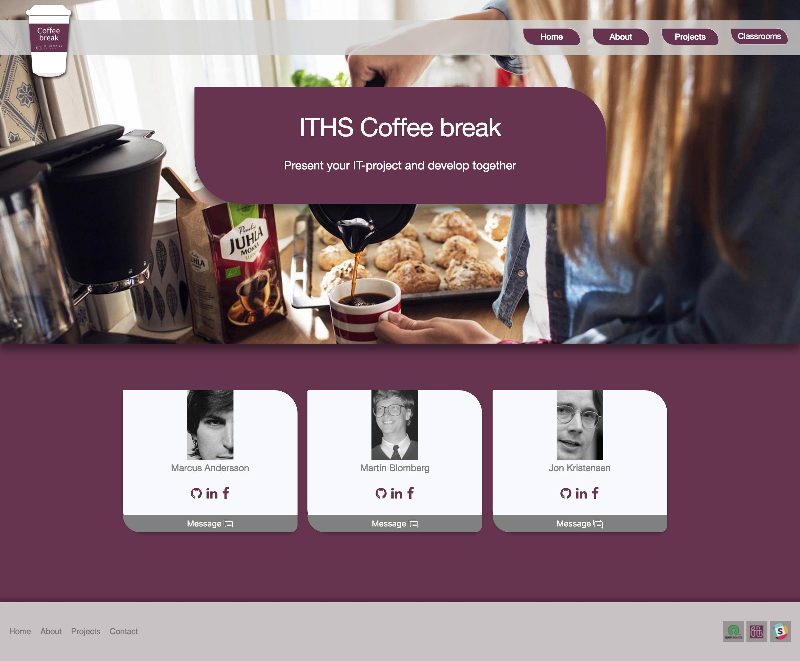

# Coffee-Break
<h3>Present your it-project to fellow students and build them together.</h3>
Coffee Break is a open source community web page that aims to serve as a collaboration and sharing platform among students and teachers at the IT-Högskolan, IT University college, in Gothenburg. Let's build this webpage to a welcoming environment where people meet and take ideas forward. The idea of the site is to encourage community activities on school or personal projects, learn from eachother and enjoy the benefits of networking. Coffee break is the meeting place and playroom where ideas start and maybe outgrow to next generation world-conquering products and services. This project is intended for the benefit of "IT-Högskolan", Gothenburg but also welcomes any contributors, developers and companies who like to get involved with the schools exiting and highly potential community. This project aims to build networks among the students and teachers and a bridge towards companies who want to synergize with the schools students that are studying to become professionals within programs including mobiledevelopment, web development, .net development and test-technologies.
 
 
If you like to get your hands dirty then welcome to read a bit further how to get involved on collaborating and how to present your ideas to the community.
 
 

<h3>How to</h3>
Welcome to cooperate on building the site that is built on basic web technologies: Html, Css, Javascript and uses Jquery
Here is a couple of links on how to get started on cooperating. We used Atom as the editor and here are some info on integrating Atom to Github and the work flow when pulling latest verisons and pushing new code. You are welcome to fork the project.

<h5>Github basics via terminal, in swedish</h5>
Git demo by Erik Svedäng
https://www.youtube.com/watch?v=YxeJ31q5zZQ&index=4&list=PL6XTrHGneb1NH0O-dapFSu7GXpXsMMWTj

Create a fork
Go to the Github project front page and choose frok in right upper corner.
Youtube demo: https://www.youtube.com/watch?v=_NrSWLQsDL4
Github documentation: https://help.github.com/articles/fork-a-repo/

Push to own fork from own clone
https://stackoverflow.com/questions/25545613/how-can-i-push-to-my-fork-from-a-clone-of-the-original-repo

Keeping a fork up-to-date with origin/master
https://gist.github.com/CristinaSolana/1885435

<h5>Atom integration to GitHub</h5>
Clone project to local folder and create Atom integration
https://www.youtube.com/watch?v=TzKi6ZZtIAo

Using Atom and Github via Terminal
https://vwannabe.com/2016/05/26/how-to-use-github-and-atom/

<h5>Be social on GitHub</h5>
https://help.github.com/articles/be-social/

<h5>About the Open Source community</h5>
https://opensource.org/community

<h3>About us</h3>
Coffee Break was started by two students, Patrik Rikama Hinnenberg and Eric Groseclos Wikås who started to hang out every monday in the classroom after the lecture hours. We believe that we need to play more together to further our development. The foundations of this initiative was a hyphothesis on the community possibilities and a gut feeling that collaborating is more fun, just like when making food together.
 
 
 

